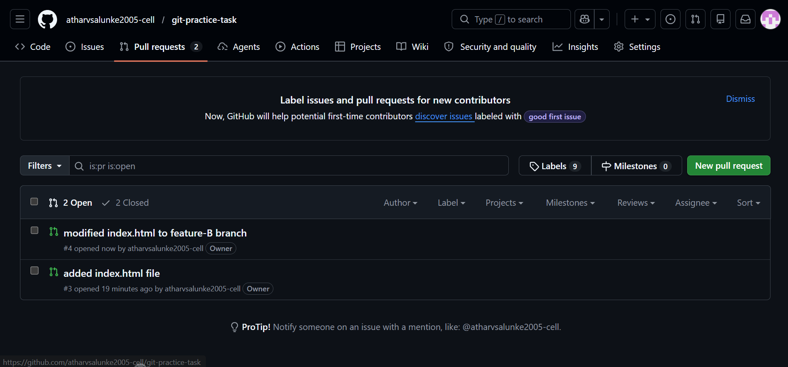
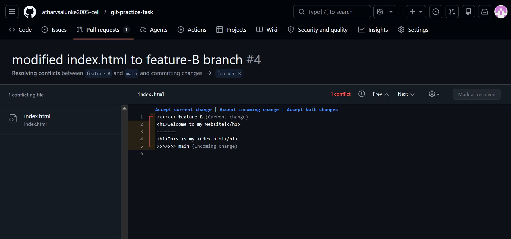
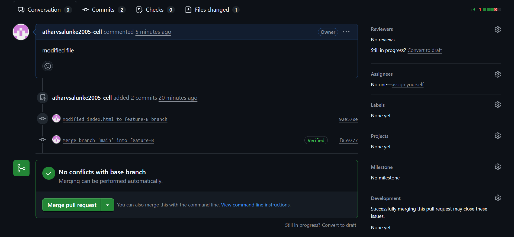
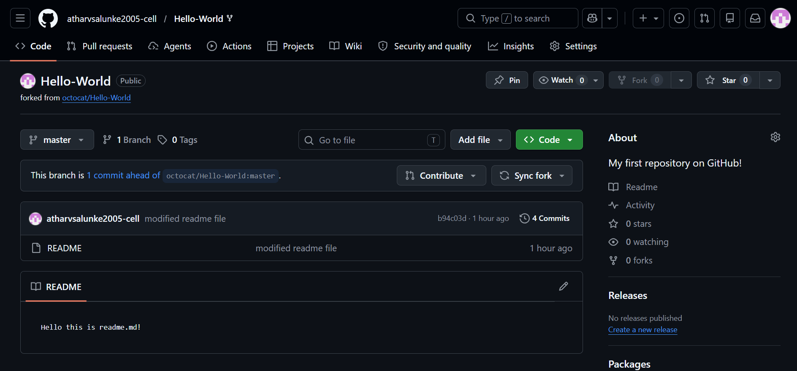
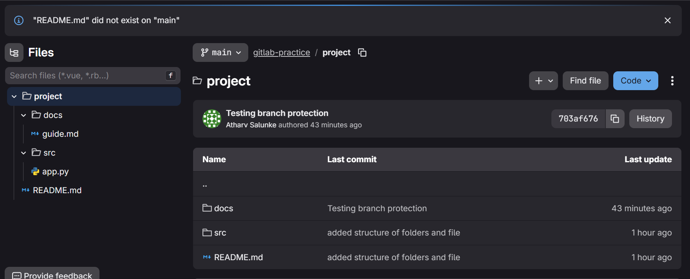
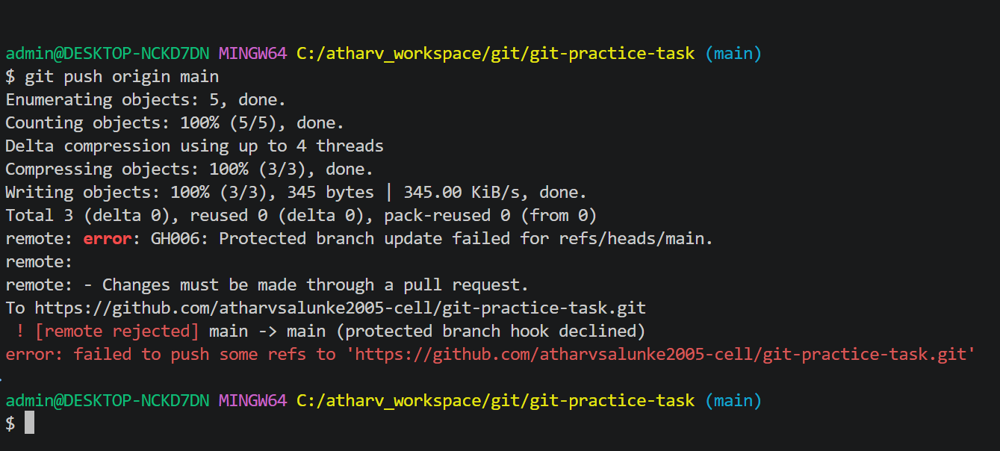
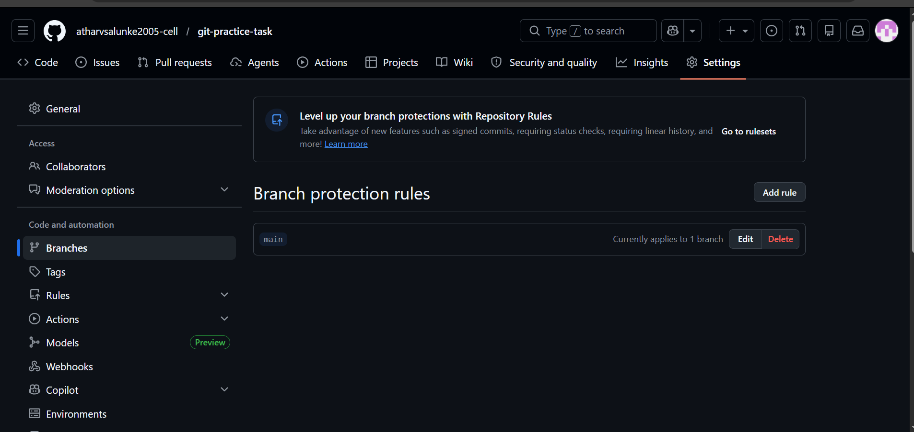

# Git & GitLab Practical Assignment

## Overview

This repository was created as part of the **Git & GitLab Practical Assignment** to demonstrate practical knowledge of:

- Git repository management
- GitHub workflow
- Branching strategy
- Pull Requests
- Merge conflict resolution
- Forking and contribution workflow
- GitLab repository management
- Repository mirroring
- Branch protection rules

---

## Assignment Completion Status

| Task | Description | Status |
|--------|-------------|---------|
| 1 | GitHub Repository Creation | ✅ Completed |
| 2 | Repository Clone | ✅ Completed |
| 3 | Initial Development on Main Branch | ✅ Completed |
| 4 | Feature-A Branch Creation | ✅ Completed |
| 5 | Pull Request (Feature-A → Main) | ✅ Completed |
| 6 | Feature-B Branch Creation | ✅ Completed |
| 7 | Merge Feature-A | ✅ Completed |
| 8 | Merge Conflict Resolution | ✅ Completed |
| 9 | Merge Feature-B | ✅ Completed |
| 10 | Fork and Contribution | ✅ Completed |
| 11 | GitLab Repository Setup | ✅ Completed |
| 12 | Repository Mirroring | ✅ Completed |
| 13 | Branch Protection Configuration | ✅ Completed |
| 14 | Final Verification | ✅ Completed |

---

# Repository Workflow

## Main Branch

The `main` branch contains the final merged version of the project.

---

## Feature-A Branch

### Tasks Performed

- Created branch `feature-A`
- Added `index.html`
- Added sample HTML content
- Committed changes
- Pushed branch to GitHub
- Created Pull Request
- Merged into `main`

---

## Feature-B Branch

### Tasks Performed

- Created branch `feature-B`
- Modified the same lines in `index.html`
- Committed changes
- Pushed branch to GitHub
- Created Pull Request
- Generated merge conflict
- Resolved conflict manually
- Successfully merged into `main`

---

# Merge Conflict Resolution

A merge conflict was intentionally created while merging `feature-B` because both branches modified the same section of the file.

## Resolution Steps

1. Attempted to merge `feature-B`
2. Observed merge conflict
3. Pulled latest changes
4. Identified conflict markers
5. Resolved conflict manually
6. Removed conflict markers
7. Committed resolved code
8. Pushed updated branch
9. Successfully merged Pull Request

---

# Fork and Contribution

A public GitHub repository was forked to demonstrate contribution workflow.

## Steps Performed

- Forked public repository
- Cloned fork locally
- Modified README file
- Committed changes
- Pushed updates
- Created Pull Request

---

# GitLab Repository Setup

A private GitLab repository was created and cloned locally using SSH.

## Project Structure

```text
project/
├── src/
│   └── app.py
├── docs/
│   └── guide.md
└── README.md
```

## Activities Performed

- Created GitLab repository
- Cloned repository using SSH
- Created required folder structure
- Added files
- Committed project structure
- Pushed changes to GitLab

---

# Repository Mirroring

Repository mirroring was configured between GitLab and GitHub.

## Verification

- Changes pushed to GitLab
- Mirroring triggered automatically
- Changes appeared in GitHub repository
- Synchronization verified successfully

---

# Branch Protection

Branch protection rules were configured on the `main` branch.

## Rules Applied

- Direct pushes disabled
- Pull Requests required before merging
- Approval required before merge
- Protected branch policy enforced

## Verification

A direct push to `main` was attempted and GitHub rejected the push with a protected branch error.

---

# Screenshots

## Pull Requests

### Feature-A Pull Request

---

## Merge Conflict Resolution





---

## Forked Repository



---

## Repository Mirroring Configuration



---

## Branch Protection Rules





---

# Final Verification Checklist

- ✅ GitHub repository created
- ✅ Repository cloned locally
- ✅ Feature-A branch created
- ✅ Feature-B branch created
- ✅ Pull Requests created
- ✅ Pull Requests merged
- ✅ Merge conflict resolved
- ✅ Fork repository created
- ✅ Contribution workflow completed
- ✅ GitLab repository configured
- ✅ Repository mirroring verified
- ✅ Branch protection enabled

---

# Repository URLs

## GitHub Repository

Add your GitHub repository URL here.

```text
https://github.com/YOUR_USERNAME/git-practice-task
```

## GitLab Repository

Add your GitLab repository URL here.

```text
https://gitlab.com/YOUR_USERNAME/gitlab-practice
```

---

# Author

**Name:** Atharv Salunke

**Batch:** 18 May 2026

**Course:** MCA DevOps

